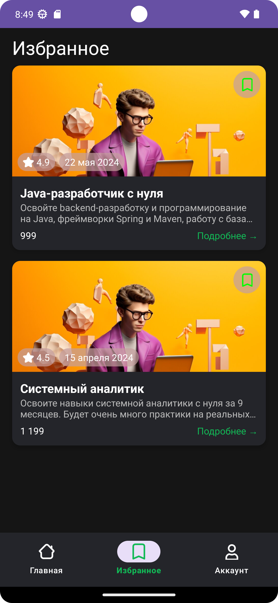
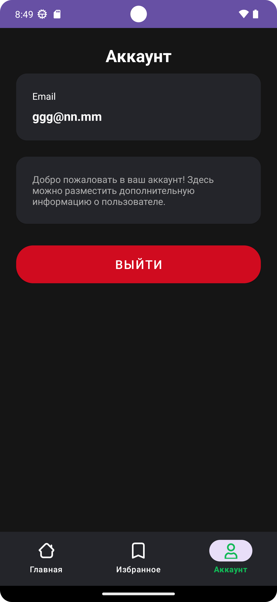
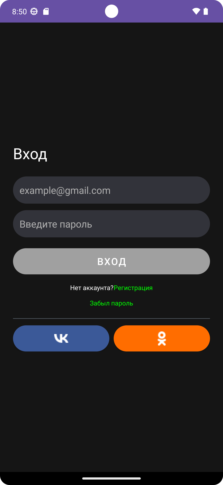

# 🎓 ThousandCourses


**ThousandCourses** — демонстрационный Android-проект для просмотра курсов с возможностью добавления в избранное и авторизацией пользователя.  
Реализован с акцентом на **чистую архитектуру (Clean Architecture)**, **модульность** и **современный стек Android**.

---

## 🧱 Основные особенности

- Многомодульная структура: `core`, `data`, `domain`, `feature_main`, `feature_login`, `feature_account`, `feature_favorites`, `app`
- Архитектура: Clean Architecture + MVVM
- DI: Koin
- База данных: Room
- Асинхронность: Kotlin Coroutines / Flow
- UI: ViewBinding + Material 3
- Данные: Локальный JSON (`assets/courses.json`) + локальная БД (избранное)
- Готово к расширению — можно подключить реальный API через Retrofit

---

## 📸 Скриншоты

| Главный экран | Экран избранного | Экран аккаунта | Экран авторизации |
|:--------------:|:----------------:|:---------------:|:--------------:|
|  |  |  |  |

---

## 🧩 Архитектура проекта

```
app/                — точка входа, MainActivity, навигация
core/               — базовые модели, утилиты (Resource, Extensions)
data/               — репозитории, Room, UserPrefs, API-заглушки
domain/             — UseCase-ы и интерфейсы репозиториев
feature_main/       — главная страница со списком курсов
feature_login/      — экран авторизации
feature_account/    — экран аккаунта пользователя
feature_favorites/  — экран избранного
```

---

## ⚙️ Технологии

- **Язык:** Kotlin  
- **Архитектура:** Clean Architecture (MVVM)  
- **DI:** Koin  
- **БД:** Room  
- **Асинхронность:** Coroutines, Flow  
- **UI:** ViewBinding, RecyclerView, Material 3  
- **Парсинг JSON:** Gson  
- **Форматирование дат:** SimpleDateFormat + Locale("ru")

---

## 📦 Основные пакеты

**core**  
- `Resource.kt` — универсальный класс состояний (Success / Error / Loading)  
- `Course.kt`, `CourseResponse.kt` — модели данных  

**data**  
- `CoursesRepositoryMock` — чтение локального JSON  
- `CoursesRepositoryImpl` — заготовка под реальный API  
- `FavoritesDao`, `AppDatabase` — Room  
- `UserPrefs`, `UserRepositoryImpl` — работа с авторизацией  

**domain**  
- `GetCoursesUseCase`, `ToggleFavoriteUseCase`, `LoginUseCase`  
- Интерфейсы: `CoursesRepository`, `FavoritesRepository`, `UserRepository`  

**feature_main**  
- `HomeFragment`, `HomeViewModel`  
- `CourseViewHolder` — биндинг данных, обработка лайков и форматирование даты  

**feature_account**  
- `AccountFragment`, `AccountViewModel` — отображение данных пользователя, выход из аккаунта

---

## 🧠 Стек технологий

| Категория | Технологии |
| ---------- | ----------- |
| Язык | Kotlin |
| Архитектура | Clean Architecture / MVVM |
| Dependency Injection | Koin |
| База данных | Room |
| Асинхронность | Kotlin Coroutines / Flow |
| UI | Material 3, ViewBinding |
| Формат данных | JSON (Gson) |
| Тестирование | JUnit, Mockito *(в перспективе)* |

---

## 💡 Возможности для расширения

- Подключение реального API через Retrofit  
- Добавление тестов для ViewModel  
- Реализация кэширования изображений (Glide / Coil)  
- Авторизация через VK / Google  
- Поддержка тёмной темы и динамических цветов  

---

## 🗓 Пример форматирования даты

```
Из JSON:  2024-05-22
Отображается как: 22 мая 2024
```

---
